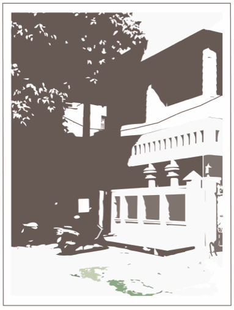

# vyakaran

Since [nilenso](https://nilenso.com)'s inception in 2013, we've made efforts to keep things maximally transparent both internally and externally. This handbook is an ongoing attempt to _open-source _our business processes, engineering practices and just generally serve as a starting point to help people both inside and outside learn about us.

Feel free to click around the links on the sidebar if you're particularly interested in a specific domain, bear with us while we make efforts to structure this handbook a bit better to read more like a guide rather than a resource.


This [blog post](https://blog.nilenso.com/blog/2014/11/19/huh-a-software-cooperative) is a great starting point to learn why we structured ourselves as a cooperative.


